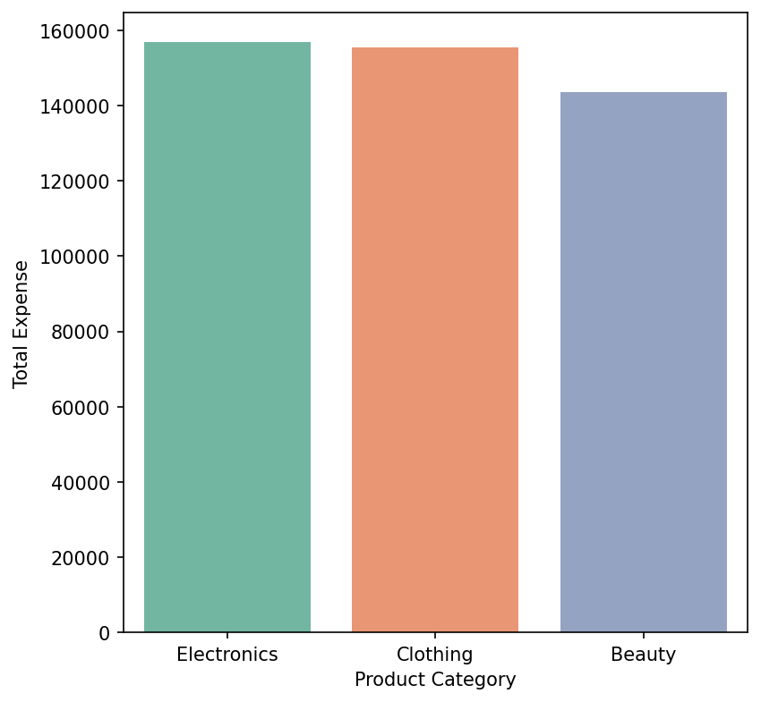
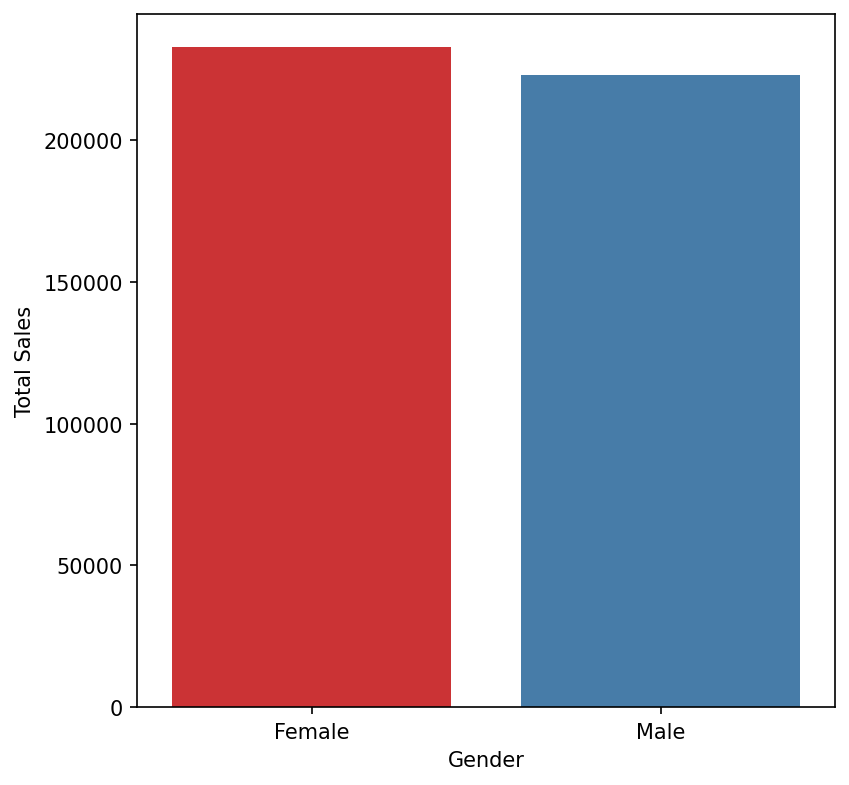
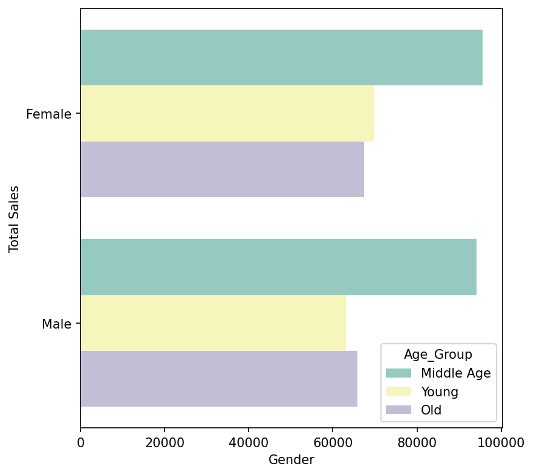
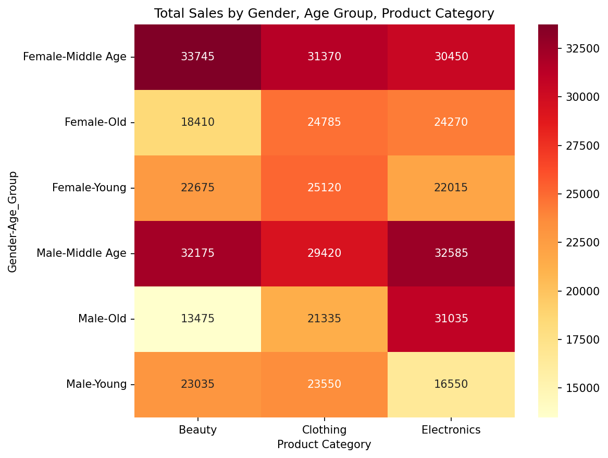
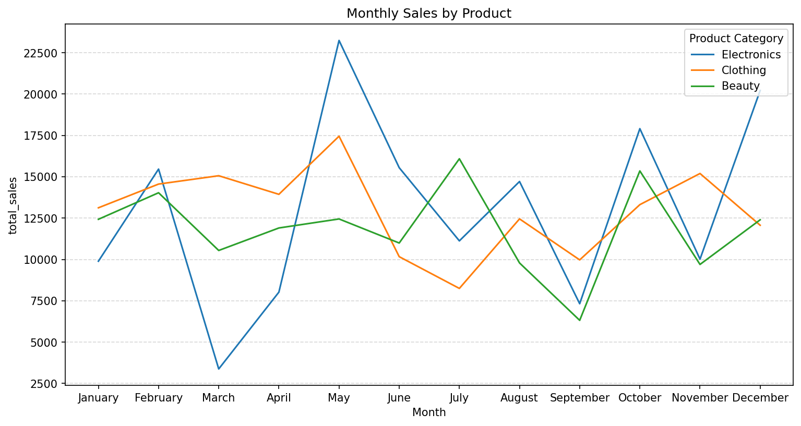
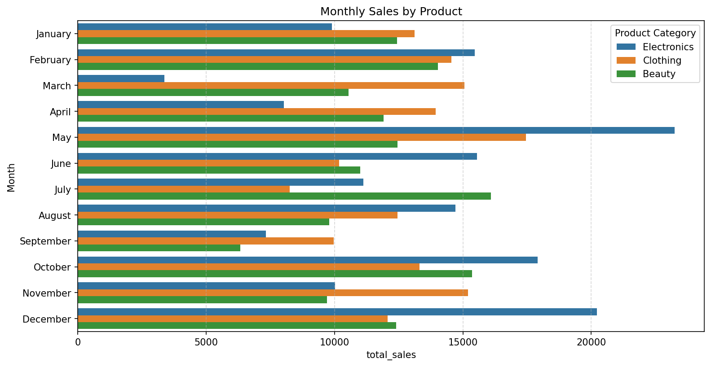
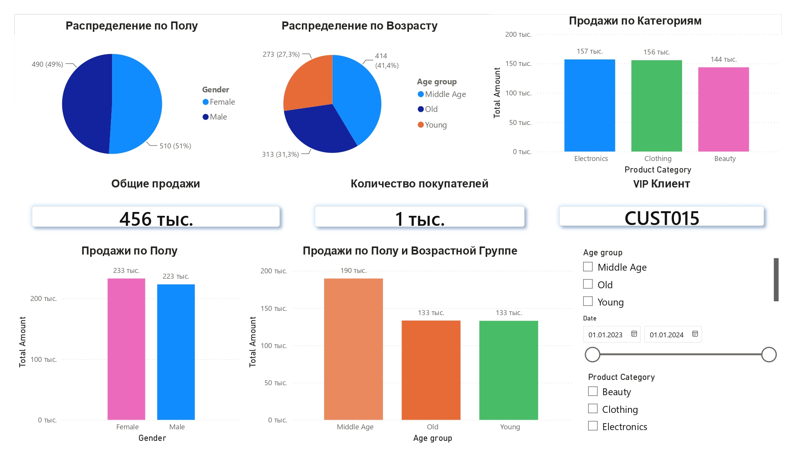

# Retail Sales EDA - анализ розничных продаж

> Разведочный анализ данных о транзакциях розничного магазина: поиск ключевых сегментов покупателей, предпочтений по категориям товаров и сезонных паттернов продаж. SQL-запросы, Jupyter-ноутбук и интерактивный дашборд в Power BI.

---

## 1. Бизнес-проблема

Розничный магазин накопил данные о транзакциях за 2023 год, но не понимает, **кто именно** приносит основную выручку и **что** покупает. Без этого невозможно принимать решения по:

- ассортименту (что закупать больше, что сокращать);
- маркетингу (на кого таргетировать кампании);
- планированию запасов по сезонам (когда ожидать пик спроса на каждую категорию).

**Цель анализа** - ответить на три вопроса:

1. Какие возрастные и гендерные группы приносят основную выручку?
2. Какие категории товаров предпочитает каждая группа?
3. Есть ли сезонность в продажах по категориям?

---

## 2. Описание датасета

**Источник:** `data/retail_sales_dataset.csv` - 1000 транзакций.

| Колонка | Тип | Описание |
|---|---|---|
| `Transaction ID` | int | Уникальный идентификатор транзакции |
| `Date` | date | Дата совершения покупки (2023 год + одна запись 2024) |
| `Customer ID` | string | Уникальный идентификатор клиента |
| `Gender` | category | Пол клиента: `Male` / `Female` |
| `Age` | int | Возраст клиента (18–64) |
| `Product Category` | category | Категория товара: `Electronics`, `Clothing`, `Beauty` |
| `Quantity` | int | Количество единиц товара в транзакции (1–4) |
| `Price per Unit` | int | Цена за единицу (25–500) |
| `Total Amount` | int | Общая сумма транзакции = `Quantity × Price per Unit` |

**Производные признаки, созданные в ходе анализа:**
- `Age_Group` - возрастные группы: `Young` (≤ 30), `Middle Age` (31–50), `Old` (> 50);
- `Month` - название месяца, приведённое к `CategoricalDtype` для корректной сортировки;
- `Year` - год из даты.

**Качество данных:** датасет чистый - пропусков нет, дубликатов нет, отрицательных значений нет.

---

## 3. Результаты анализа

### 3.1 Распределение по полу

Женщин и мужчин в датасете почти поровну: **510 против 490** (51% / 49%). Это значит, что любые различия в поведении между полами не связаны с размером выборки.

### 3.2 Распределение по возрасту

Возрастные группы представлены неравномерно:

| Возрастная группа | Транзакции | Доля |
|---|---:|---:|
| Middle Age (31–50) | 414 | 41.4% |
| Old (> 50) | 313 | 31.3% |
| Young (≤ 30) | 273 | 27.3% |

Покупатель среднего возраста - доминирующая группа, и уже это показывает, куда смещена выручка.

### 3.3 Общая выручка по категориям

| Категория | Выручка | Доля |
|---|---:|---:|
| Electronics | 156 905 | 34.4% |
| Clothing | 155 580 | 34.1% |
| Beauty | 143 515 | 31.5% |

Категории распределены практически равномерно (разброс - меньше 10%).

### 3.4 Выручка по полу

| Пол | Выручка |
|---|---:|
| Female | 232 840 |
| Male | 223 160 |

Женщины тратят чуть больше, но разница - в пределах 3%, что практически незначимо.

### 3.5 Пол × Возраст

| Пол | Возрастная группа | Выручка |
|---|---|---:|
| Female | Middle Age | **95 565** |
| Male | Middle Age | **94 180** |
| Female | Young | 69 810 |
| Female | Old | 67 465 |
| Male | Old | 65 845 |
| Male | Young | 63 135 |

**Ключевой вывод:** сегмент «средний возраст» (31–50 лет) - независимо от пола - приносит почти в полтора раза больше, чем любая другая группа. Это ядро аудитории.

### 3.6 Пол × Возраст × Категория (heatmap)

Расшифровка ключевых ячеек:

- **Женщины среднего возраста** тратят больше всего на **Beauty** - лидирующая комбинация по всей матрице.
- **Мужчины среднего возраста** - примерно поровну на **Electronics** и **Beauty**.
- **Пожилые мужчины** - ярко выраженный перекос в **Electronics**.
- **Молодёжь обоих полов** распределена по категориям ровнее - без доминирующего любимого продукта.

### 3.7 Сезонность по месяцам

У каждой категории - свои пиковые месяцы:

| Категория | Пиковые месяцы |
|---|---|
| **Electronics** | Май, Октябрь, Декабрь |
| **Clothing** | Январь, Март, Апрель, Ноябрь |
| **Beauty** | Июль, Октябрь |

Операционный вывод: закупки под каждую категорию нужно готовить заранее - за 4–6 недель до пика.

### 3.8 Итоговые бизнес-выводы

1. **Ядро аудитории** - люди среднего возраста (31–50 лет), независимо от пола. Они генерируют ~40% выручки.
2. **Женщины среднего возраста → Beauty**, мужчины среднего возраста → **Electronics + Beauty**, пожилые мужчины → **Electronics**. Это три самые горячие точки для таргетинга.
3. **Сезонность у каждой категории своя.** Универсального горячего месяца нет - маркетинговый календарь должен быть отдельным под каждую категорию.
4. **Молодёжь (< 30) - слабое звено** по выручке. Возможные причины: меньше покупают или меньше тратят за раз. Требует отдельного исследования.

---

## 4. Дашборд

> Кликните на превью, чтобы открыть полный `.pbix`-дашборд в Power BI.

---

## 5. Стек

- **Python 3.11** - pandas, numpy
- **matplotlib, seaborn** - визуализации
- **DuckDB** - SQL-запросы к датасету
- **Jupyter / Google Colab** - исследование
- **Power BI** - итоговый дашборд

---
